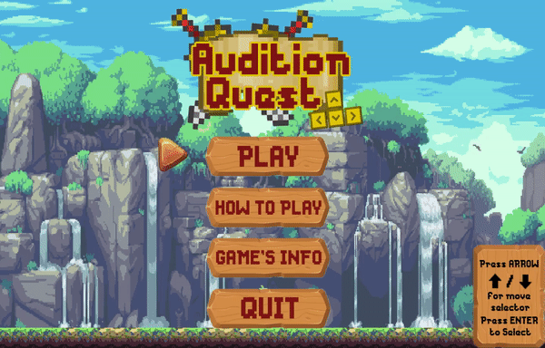
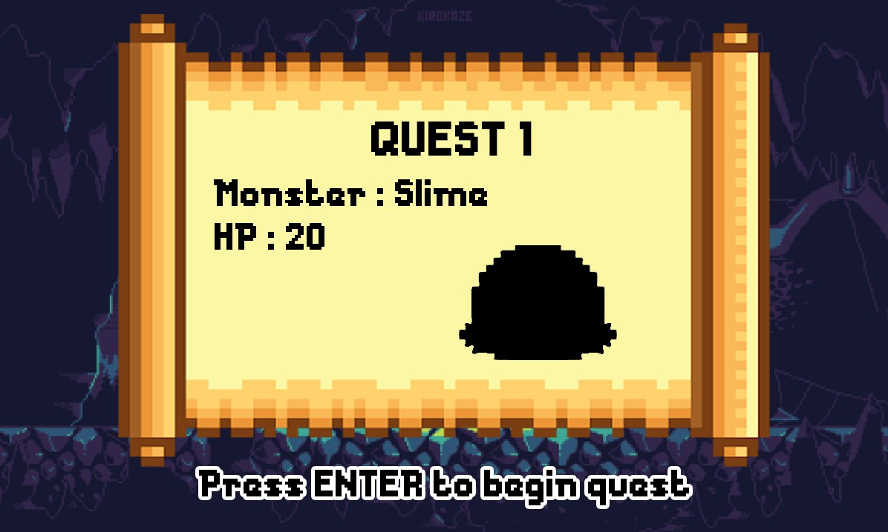
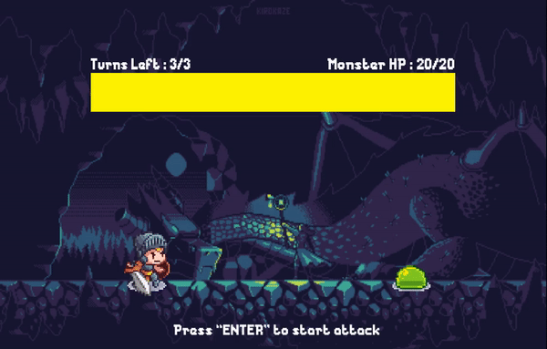
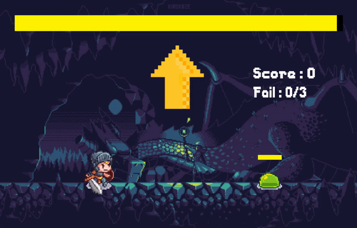
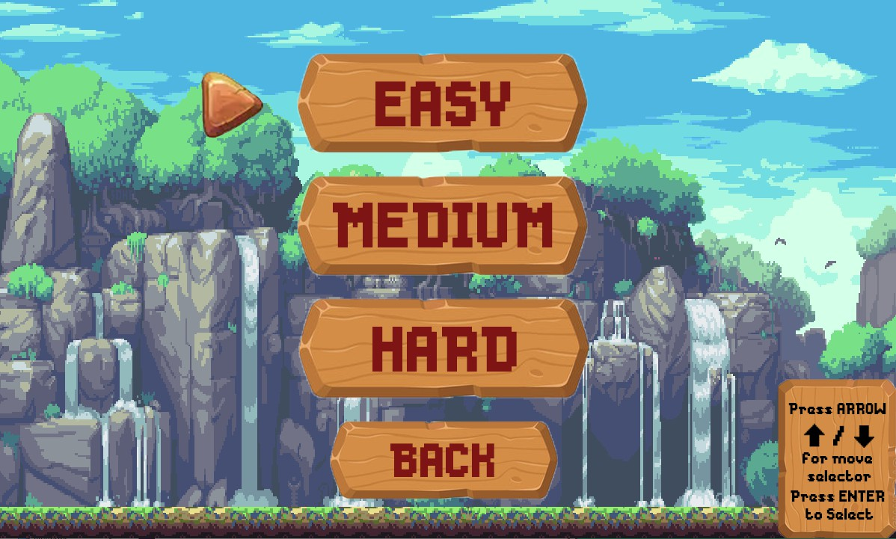
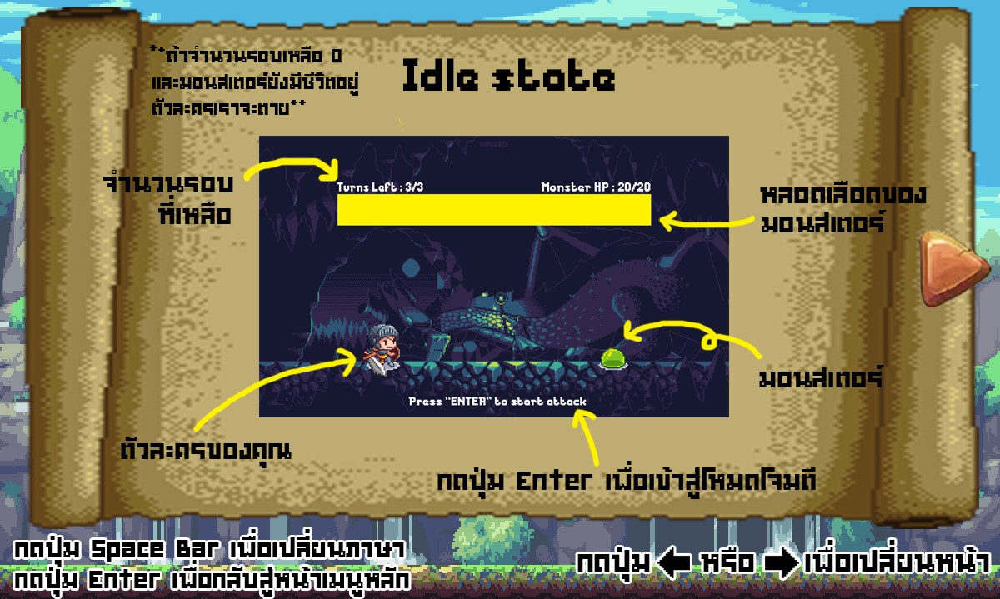
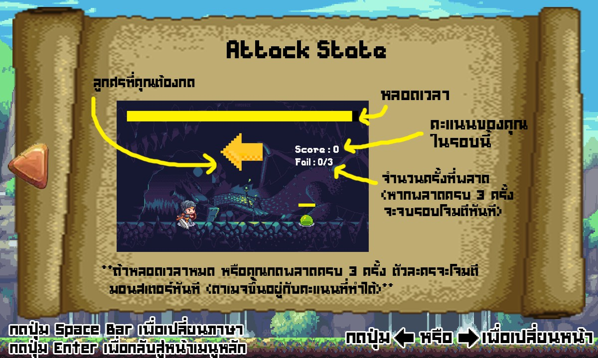
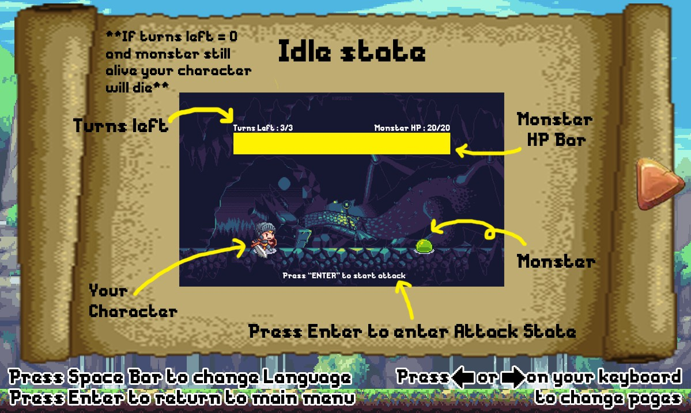
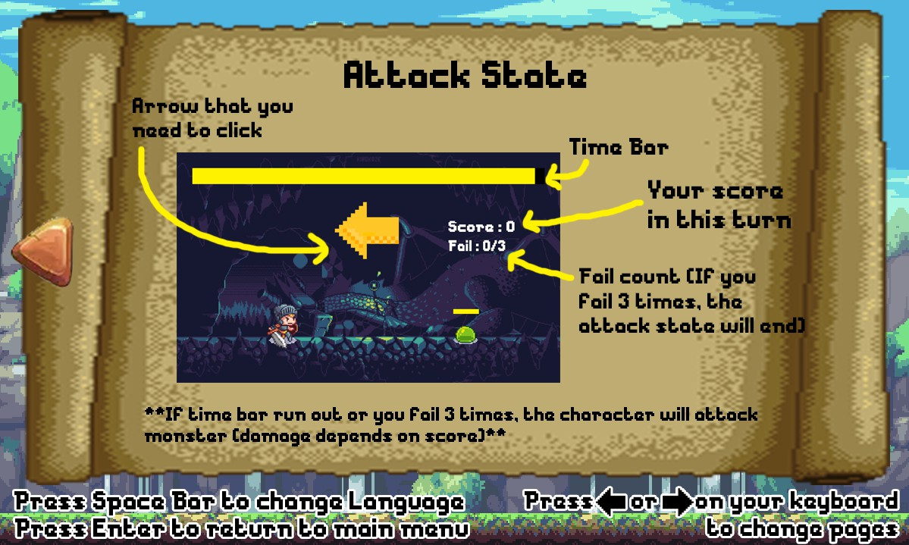

# Audition Quest : Game

This repository is a project in Computer Programming, 
Faculty of Information Technology King Mongkut's Institute of Technology Ladkrabang (IT KMITL). 
<h6>Start: 24-Jan-2020 
Finish: 8-May-2020</h6>

## Abstract :memo:
คณะผู้จัดทำมีวัตถุประสงค์เพื่อให้ผู้ที่สนใจ ได้ศึกษาค้นคว้าข้อมูลเกี่ยวกับเกม โดยเนื้อหาของเกมจะมีลักษณะคล้ายเกมออดิชั่นผสมกับเกม RPG เป็นการสุ่มบนล่างซ้ายขวา ให้กดภายในเวลาที่กำหนด หากกดทันก็จะทำดาเมจใส่ศัตรู หากกดไม่ทันจะโดนดาเมจใส่ตัวเอง และในการเล่นแต่ละครั้งจะมีด่าน พร้อมกับระดับความยาก-ง่ายให้เลือกเล่น ส่วนแต่ละความยาก จะมีศัตรูที่แตกต่างกัน และเวลาในการกดก็จะลดลงตามความยาก 

## Benefits :game_die:
ฝึกสมาธิ ความอดทนและการตอบสนองของร่างกาย โดยใช้เกมในการทำให้อยากเล่น

## Video Presentation :clapper:
<h4>link Video - https://youtu.be/n2Cm-XP3bQM </h4> 

## Built With :wrench:
- C Language.
- Library SDL.

## Download :open_file_folder:
- Download zip file from [here](https://github.com/jeffy34931/Compro_Project)
- Extract the file.
- Run "Audition Quest.exe" to start.

## In Game :video_game:
 
 

## Difficulty :space_invader:

## How to play (TH/EN) :bulb:
- ในโหมดพัก จะมีเลือดมอนสเตอร์ จำนวนรอบที่เหลือแสดงให้ดูสามารถกด EnTer เพื่อเข้าสู่โหมดโจมตีได้ หากจำนวนรอบถึง 0 จะถือว่าแพ้ แล้วจะโดนมอนสเตอร์โจมตีทันที
- ในโหมดโจมตี จะมีเวลาจำกัด ซึ่งดูได้จากหลอดด้านบน ถ้าหากหลอดเวลาหมด หรือกดพลาดครบ 3 ครั้งจะจบโหมดโจมตีทันที ซึ่งดาเมจจะขึ้นอยู่กับคะแนนที่ทำได้  
 
 

## Author :computer:
|||||
|:---:|:---:|:---:|:---:|
|[WorachetNimcharoen](https://github.com/WorachetNimcharoen)|[jinnygym](https://github.com/jinnygym)|[ArayaThongleg](https://github.com/ArayaThongleg)|[jeffy34931](https://github.com/jeffy34931)|
|นายวรเชษฐ์ นิ่มเจริญ - 61070196 -|นางสาวศุภิสรา ชีวนันทพร - 61070230 -|นางสาวอารยา ทองเล็ก - 61070270 -|นายชวิน โล่ห์รัตนเสน่ห์ - 62070045 -|
